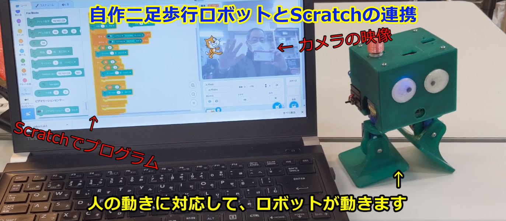

[](http://www.ytani.net:8080/tmp/OttoPi/OttoPi-Scratch.mp4)

# OttoPi: Otto DIY like biped robot for Raspberry Pi (Zero)

## About

Raspberry Pi Zeroをベースに、
[Otto DIY](https://www.ottodiy.com/)のような
二足歩行ロボットを作って見ました。

Raspberry Piがベースと言うことで、
本家の[Otto DIY](https://www.ottodiy.com/)とは違い、
以下のような特徴があります。

* 距離センサーで障害物を検知して、自動的に歩き回ります。
* BLE経由で、スクラッチ(の拡張機能)から、制御することができます。
* Wi-Fi経由で、スマートフォンからマニュアル操作するこができます。
* 音声合成機能内蔵(OpenJTalk)で、自由な文章をしゃべらせることができます。
* Scrtchの独自拡張機能を利用して、Scratchからロボットを制御できます。

以下、まだまだドキュメントが未整備で、最新の状態ではありません。
m(_ _)m

## Control with Scratch 3.0

* (for PC) run ``Scratch Link``
* [Scratch & 専用拡張機能](https://ytani01.github.io/scratch-gui/)


## 3D model

T.B.D


## Hardware

### BOM (Bill of Materials)

| Item | Qty |
|------|-----|
| Raspberry Pi Zero WH | x1 |
| 18650 battery        | x1 |
| battery box          | x1 |
| SG-90 Servo Motor    | x4 | 


### T.B.D.


## Install software

### make Python3 venv

```bash
$ cd ${HOME}
$ python3 -m venv env1
```


### download

```bash
$ cd ~/env1
$ git clone https://www.github.com/ytani01/OttoPi.git
```

### install 

```bash
$ cd ~/env1/OttoPi
$ ./setup.sh
```


## Access from smartphone or PC

``http://{IP address}:5000/``


## References

* [Otto DIY](https://www.ottodiy.com/)
* [Open JTalk](http://open-jtalk.sp.nitech.ac.jp/)
